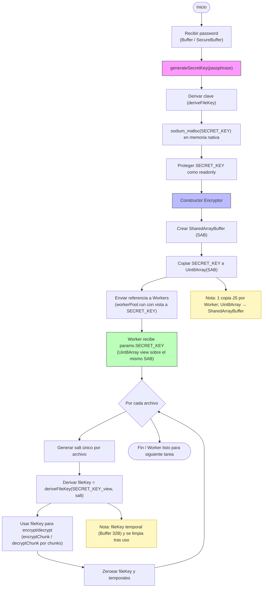

# @kira-encryptor/core

Biblioteca que concentra la lógica criptográfica y de orquestación de Kira Encryptor. Expone helpers para derivar claves seguras, operar sobre el sistema de archivos mediante `worker_threads` y llevar un inventario cifrado de los artefactos procesados.

## Características clave
- **Clave maestra aislada**: se deriva una `SECRET_KEY` desde la contraseña del usuario y se comparte con los workers mediante `SharedArrayBuffer` para evitar copias intermedias en memoria.
- **Pool de workers**: `Piscina` reparte las tareas de cifrado/descifrado, respetando el límite de hilos configurado (`maxThreads`).
- **Cifrado por chunks**: los archivos se procesan en bloques de `512KiB` + `crypto_secretbox_MACBYTES`, permitiendo manejar ficheros grandes con un consumo estable.
- **Storage cifrado**: el catálogo de archivos/carpeta se persiste en `@seald-io/nedb`, pero cada registro se cifra íntegramente con la misma `SECRET_KEY`.
- **Utilidades de FS resilientes**: `FileSystem` implementa reintentos exponenciales para renombrar, copiar o eliminar elementos ocupados por otros procesos.

## Instalación
```bash
pnpm add @kira-encryptor/core
# o
npm install @kira-encryptor/core
```

### Dependencias nativas
- Requiere Node.js >= 18 y una toolchain capaz de resolver `sodium-native` en la plataforma objetivo.
- En Windows asegúrate de contar con Visual Studio Build Tools o usa los prebuilds incluidos.

## Primeros pasos
```ts
import { encryptorWorkerPath } from "./workers/index";
import Encryptor from "@kira-encryptor/core";
import path from "node:path";

const password = Buffer.from(process.env.PASSWORD!, "utf8");

const encryptor = await Encryptor.init(password, encryptorWorkerPath, {
  maxThreads: 4
});

await encryptor.encryptFile({
  filePath: "./demo/video.mp4",
  onProgress: (processed, total) => {
    console.log(`Progreso: ${((processed / total) * 100).toFixed(1)}%`);
  },
  onEnd: (error) => {
    if (error) console.error("Error cifrando", error);
  }
});
```
> Si llamas a `Encryptor.init(password)` sin `workerPath`, recibirás el modo **BasicEncryptor** (solo API de `Storage`).

## Opciones y entorno
| Variable / Opción | Default | Descripción |
| --- | --- | --- |
| `encoding` / `ENCODING` | `base64` | Codificación usada para serializar información en `Storage`. |
| `libraryPath` / `LIBRARY_PATH` | `./library.json` | Ubicación del archivo de catálogo cifrado. |
| `maxThreads` / `MAX_THREADS` | `1` | Máximo de workers simultáneos que Piscina puede lanzar. |
| `minDelayPerStep` | `300` ms | Latencia mínima para permitir que los spinners CLI sean visibles. |
| `silent` | `false` | Oculta mensajes en consola (mantiene barras de progreso). |
| `enableLogging` / `LOG` | `false` | Genera logs `.enc.log` / `.dec.log` por archivo procesado. |
| `allowExtraProps` | `false` | Permite incluir propiedades personalizadas al registrar un archivo/carpeta. |

## Arquitectura general
El flujo global parte de la contraseña del usuario, deriva una clave maestra y reparte trabajos a los workers, reutilizando la misma vista de memoria para minimizar el riesgo de fugas.



## API pública
### `Encryptor`
| Método | Firma | Descripción |
| --- | --- | --- |
| `init` | `static init(password, workerPath?, options?)` | Crea la instancia, configura Storage y (opcionalmente) inicializa el pool de workers. |
| `encryptFile` | `encryptFile({ filePath, onProgress?, onEnd?, extraProps? })` | Cifra un archivo individual, genera `.enc.tmp` mientras se realiza la operacion, al terminar lo reemplaza por el original y registra los metadatos en `Storage`. |
| `decryptFile` | `decryptFile({ filePath, onProgress?, onEnd? })` | Restaura el archivo original desde su `.enc`, limpiando temporales tras el reemplazo. |
| `encryptFolder` | `encryptFolder({ folderPath, onProgress?, onEnd?, extraProps? })` | Itera recursivamente sobre la carpeta; primero cifras subcarpetas, luego archivos, preservando jerarquía. |
| `decryptFolder` | `decryptFolder({ folderPath, onProgress?, onEnd? })` | Recorrido inverso: descifra hojas primero, luego reconstituye directorios y registros. |
| `hideStoredItem` / `revealStoredItem` | `(itemId: string) => Promise<boolean>` | Cambia el atributo `isHidden` en disco usando `hidefile` y sincroniza `Storage`. |
| `getStorage` | `() => Promise<Map<string, StorageItem>>` | Devuelve instantánea de la base cifrada en memoria. |
| `refreshStorage` | `() => Promise<void>` | Mantiene compatibilidad con versiones previas; actualmente es un no-op (deprecated). |
| `destroy` | `() => Promise<void>` | Libera el pool de workers (se invoca automáticamente tras cada operación externa). |

### `Storage`
| Método | Descripción |
| --- | --- |
| `constructor(secretKey, encoding, dbPath?)` | Inicializa `Nedb` con hooks para cifrar/descifrar cada línea al vuelo. |
| `getAll()` | Retorna `Map<_id, StorageItem>` con todos los registros cargados en memoria. |
| `get(id)` | Busca un elemento por `_id`. |
| `set(item)` | Inserta un `FileItem`/`FolderItem` (sin `_id`), genera uno nuevo y devuelve la versión persistida. |
| `update(id, item)` | Actualiza campos existentes; respeta `allowExtraProps` configurado en `Encryptor`. |
| `delete(id)` | Elimina un registro y retorna su versión previa (útil al restaurar). |

### `FileSystem`
| Método | Descripción resumida |
| --- | --- |
| `getStatFile(path)` | Wrapper seguro de `fs.statSync` con errores más explícitos. |
| `getFolderSize(dir)` | Recorre recursivamente para estimar bytes totales antes de cifrar. |
| `createReadStream / createWriteStream` | Streams de Node con validaciones de existencia. |
| `replaceFile(source, dest, data)` | Copia atómica entre archivos temporales y destino final, eliminando residuos. |
| `removeItem`, `copyItem`, `safeRename` | Operaciones tolerantes a `EBUSY`/`EPERM` con backoff. |
| `itemExists`, `readDir`, `createFolder` | Helpers sincronizados que encapsulan manejo de errores. |

## Flujo típico de cifrado
1. **Preparación**: Validar rutas con `FileSystem`, calcular tamaños y reiniciar contadores (`processedBytes`).
2. **Trabajo en worker**: se envía la tarea a `Piscina` junto con `SECRET_KEY` (Uint8Array sobre SAB) y un `MessagePort` para escuchar progreso/errores.
3. **Escritura segura**: el worker produce un archivo temporal (`.enc.tmp`) que luego se mueve al destino final; se generan logs opcionales.
4. **Registro**: `Storage.set` guarda `encryptedName`, `originalName`, `size`, estado `isHidden` y cualquier `extraProps` autorizado.
5. **Limpieza**: se cierran los `MessagePort`, se borran temporales y, si la llamada se originó fuera de un flujo interno, se destruye el pool.

## Pruebas y desarrollo
```bash
pnpm install
bun run tests # Ejecuta la suite de Vitest definida en core/tests
```

- Ejecuta el debugger usando `pnpx tsx <filename>.ts`.
- Para depurar `Storage`, establece `LOG=true` y revisa los archivos `.log` generados por cada operación.

---
Para dudas adicionales o contribuciones, abre un issue en el repositorio principal o menciona a `@JMMOLLER` en las discusiones.